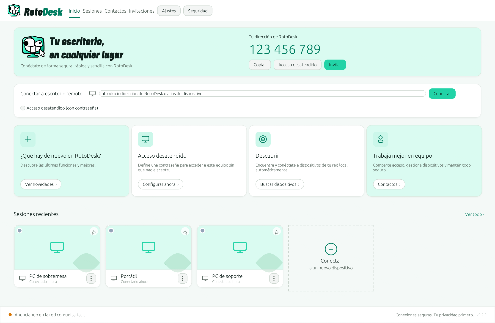
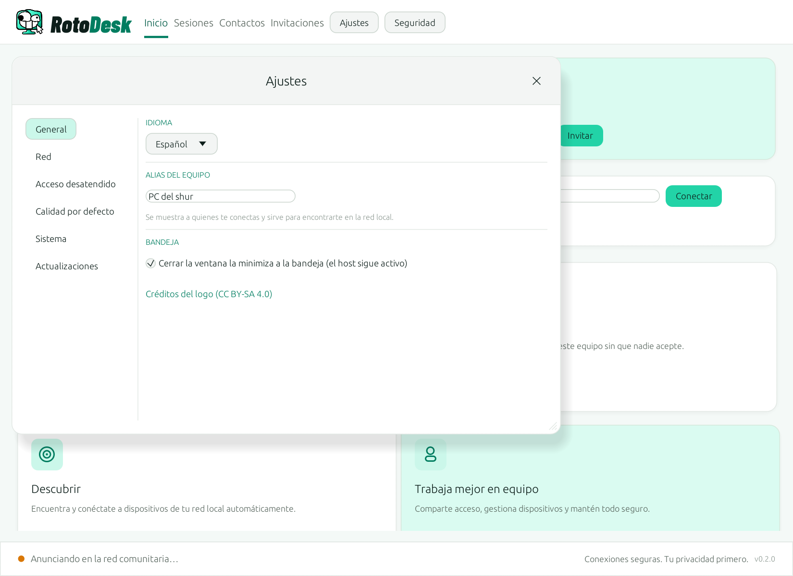

# CleanDesk

**CleanDesk** is a fast, lightweight and secure remote desktop platform written
in **Rust**. It lets you connect to another machine using a unique identifier
(**CleanDesk ID**) to view its screen, control keyboard and mouse, transfer
files and provide support — using **P2P connections** whenever possible and a
**relay** when it is not.

> **Origin (original work):** CleanDesk is an **independent, in-house**
> implementation, built from its [definition sheet](docs/SPEC.md) on top of
> standard, public-domain protocols and techniques (WebRTC/ICE/STUN/TURN, DXGI
> Desktop Duplication, SendInput). Identity, protocol, IDs and ports are
> CleanDesk's own.

---


<p align="center">
  
</p>

## Why CleanDesk

- **Peer-to-peer, no servers to run.** Type an ID and connect. Machines find
  each other on the LAN (mDNS) or through the BitTorrent DHT, exchange the
  WebRTC handshake directly or over public Nostr relays, and then talk
  **directly to each other** over DTLS. Nobody in the project (or you) has to
  host anything.
- **End-to-end encrypted by design.** Video, input and control ride WebRTC
  data channels (DTLS). Rendezvous systems only ever see signed hints; the
  first session pins the remote key (trust on first use) and the fingerprint is
  one click away.
- **Fast and light.** Native Rust, DXGI Desktop Duplication, a tile-based codec
  that only re-encodes what changed, adaptive quality driven by measured RTT.
- **Unattended access done right.** Argon2id-hashed password, HMAC
  challenge/response over the encrypted channel, per-caller lockout after
  failed attempts, and a Windows service that keeps the host reachable before
  sign-in.
- **Works behind NAT.** UPnP port mapping when the router allows it, STUN hole
  punching, and community TURN relays anyone can contribute with one
  environment variable.
- **Private mode for companies.** Point every client at your own CleanDesk
  Server and Relay and nothing leaves your network.
- **Multi-language.** English by default, follows the system language (Spanish
  included), switchable in Settings.
- **Lives in the tray.** Closing the window minimizes CleanDesk to the system
  tray and the host keeps serving; quit from the tray menu (configurable).
  Launching it again just brings the existing window back (single instance per
  data directory).
- **Everything you expect in a session.** Two-way text clipboard sync, file
  transfer (drag a file onto the remote screen; incoming files are offered and
  confirmed), remote actions (Ctrl+Alt+Del substitute, Task Manager, lock the
  remote session, block the remote keyboard and mouse, restart the machine),
  chat, multi-monitor, quality profiles. Every action is gated by the
  permissions the host granted.
- **Keeps itself up to date.** Checks GitHub Releases, downloads the MSI,
  verifies its SHA-256 against the published checksums and upgrades in place.
- **Wake-on-LAN.** Hosts announce their MAC address with their signed record;
  saved devices can be woken from the address book with one click.

<p align="center">
  
</p>

## Status

Functional. **Community mode by default**: nobody needs to run any servers.
Each machine announces itself, signed, on the local network (mDNS) and in the
BitTorrent DHT; signaling travels through public Nostr relays, end-to-end
encrypted; and UPnP + STUN + community relays get through NAT. The **private
server mode** (CleanDesk Server + Relay) remains available for businesses.
See [docs/RUN.md](docs/RUN.md) to try it, [docs/ROADMAP.md](docs/ROADMAP.md)
for the per-milestone detail and [docs/ARCHITECTURE.md](docs/ARCHITECTURE.md) for the design.

| Component | Crate | Status |
|---|---|---|
| Shared protocol | `crates/proto` | ✅ Implemented (tests) |
| Cryptography / identity / auth | `crates/crypto` | ✅ Implemented (tests) |
| Signaling server | `crates/signal-server` | ✅ Registration with proof of identity, rate limiting, roles (tests + e2e) |
| P2P transport (WebRTC) | `crates/transport` | ✅ Implemented (loopback test) |
| Screen capture (DXGI) | `crates/capture` | ✅ Implemented (real capture verified) |
| Video codec | `crates/codec` | ✅ Implemented (tests) |
| Input injection | `crates/input` | ✅ Implemented (tests) |
| Session orchestration | `crates/core` | ✅ Implemented (tests) |
| Host / viewer role | `crates/host`, `crates/client` | ✅ Implemented (brute-force protection, on-demand keyframe, RTT/FPS/kbps, Auto quality) |
| GUI (egui) | `crates/gui` | ✅ Implemented (light theme, Home/Sessions/Contacts/Invitations, session cards with thumbnails, nearby devices, settings, multi-monitor viewer with actions, clipboard and files) |
| App / entry point | `crates/app` | ✅ GUI / `--host` / `--connect` / `--signal-url` / `--data-dir` (tests) |
| Relay (TURN fallback) | `crates/relay-server` | ✅ TURN server (RFC 5766); community mode announced in the DHT (tests) |
| Serverless discovery | `crates/discovery` | ✅ mDNS, BitTorrent DHT (BEP 44), Nostr NIP-44 signaling, UPnP (tests + e2e) |
| Windows integration | `crates/platform` | ✅ Start with Windows, SCM service, presence lock |
| Installer (MSI) | `installer/` | ✅ WiX MSI with start-with-Windows and desktop-shortcut options (also silent via `msiexec` properties) |
| Installer | `installer/` | ✅ MSI (WiX) with shortcuts and firewall rules |

---

## Three-component architecture

```
                    ┌──────────────────────┐
                    │   CleanDesk Server    │  ID registration + resolution
                    │  (WSS signaling)      │  + WebRTC signaling relay
                    └──────────┬───────────┘
              signaling        │        signaling
        ┌──────────────────────┴──────────────────────┐
        │                                              │
 ┌──────▼───────┐   P2P (WebRTC/DTLS/SRTP)     ┌──────▼───────┐
 │  Client A    │◄────────────────────────────►│  Client B    │
 │  (viewer)    │      whenever possible        │  (host)      │
 └──────┬───────┘                              └──────┬───────┘
        │           ┌────────────────────┐            │
        └──────────►│  CleanDesk Relay   │◄───────────┘
          fallback  │  (TURN, end-to-end │  fallback
                    │   encrypted)       │
                    └────────────────────┘
```

## Building

Requirements: stable Rust (1.85+) and Visual Studio Build Tools (MSVC).

> If you want to build on another drive, copy `.cargo/config.example.toml` to
> `.cargo/config.toml` and adjust `target-dir` (that file is not versioned).

```powershell
cargo build --workspace            # build everything
cargo test  --workspace            # tests
cargo run -p cleandesk-signal-server   # start the signaling server
cargo run -p cleandesk-app             # start the app (GUI)
```

## Security

All communication is encrypted; each device's identity is an Ed25519 key pair;
the unattended-access password is stored only as an Argon2id hash. Details and
threat model in [docs/SECURITY.md](docs/SECURITY.md).

## License

MIT OR Apache-2.0.
